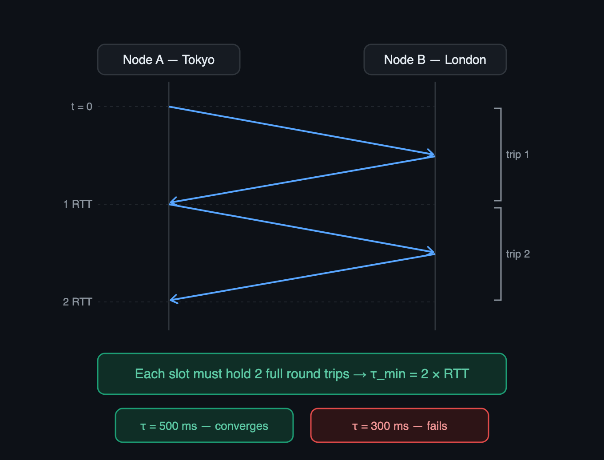
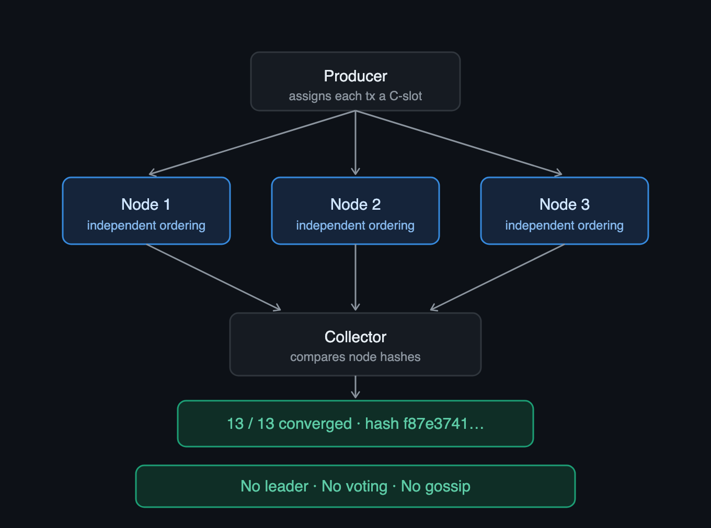
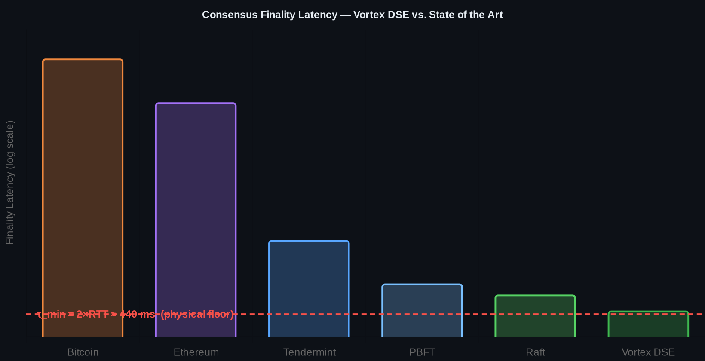

# Vortex DSE: Deterministic Consensus at the Physical Lower Bound

**Vasilis Nasopoulos**
vasilis_nasopoulos@hotmail.com

*Public draft · June 2026*

---

## Abstract

We present Vortex DSE (Deterministic Slot Engine), a distributed consensus
protocol that achieves finality without leader election, voting rounds, or
gossip. The protocol imposes a globally shared, deterministic time structure on
transactions, enabling independent and identical ordering at every node. We show
that the minimum achievable slot period is **τ_min = 2×RTT** — the physical lower
bound imposed by the speed of light — and confirm this experimentally across 13
nodes in 13 countries. A core set of safety properties is machine-checked in TLA+ (TLC + Apalache + TLAPS, 8M+ states, 0 errors); the engine additionally enforces 14 runtime invariants (I1–I14) on every execution. The protocol sustains tens of thousands of transactions per second per node.

---

## 1. Problem

Classical consensus protocols (Paxos [3], Raft [5], BFT variants [4, 6]) require coordination:
a distinguished leader, a quorum vote, or a gossip phase. This coordination
imposes a latency floor well above the physical minimum. Bitcoin [7] finalizes in
~60 minutes. Ethereum [8] in ~13 minutes. Even the fastest BFT systems require 3–6
round trips, placing finality at 1–6 seconds on a global WAN.

The fundamental question is: *what is the minimum time for a set of
geographically distributed nodes to agree, and can a protocol achieve it?*

---

## 2. Key insight

Agreement requires that every node receives the same information before deciding [1].
The minimum time for information to travel between any two nodes is one RTT.
Therefore the minimum slot period for global convergence is:

> **τ_min = 2 × RTT_max**

No protocol can do better — this is a consequence of the speed of light, not a
limitation of any particular algorithm. Vortex DSE is designed to achieve this
bound.

*Figure 3 — Why 2×RTT is the floor. A slot must contain two full round trips between the farthest nodes; below 2×RTT (e.g. τ = 300 ms) convergence fails.*

---

## 3. How it works

Vortex DSE assigns every transaction to a deterministic *canonical slot*
(C-slot) based on arrival time and a global cadence. Each node independently
computes the same slot assignment without communicating with other nodes. When
the slot closes, all honest nodes hold identical ordered sets.

The cadence **adapts to the sustained throughput of the hardware** — the system
finds the natural rate of each machine rather than pushing it until it breaks. A
**third-order control compensator** [15] tracks clock drift in real time; in WAN
tests the residual tracking error was on the order of 100 μs — roughly 4×
better than first-order smoothing.

Three roles operate independently: **Producer** (injects transactions with
C-slot labels), **Node** (admits transactions into the correct slot, rejects
duplicates and future-dated entries), **Collector** (verifies convergence by
comparing hashes across all nodes). No role is a leader. Any node can verify any
other.

*Figure 2 — The three roles. Note the absence of any arrows between nodes: they never communicate, yet converge on the same state.*

---

## 4. Verification

Vortex DSE is verified at two levels.

**Machine-checked in TLA+.** A core set of safety properties is proven with the TLA+ toolchain [10]: the TLC model checker [11] (8,000,000+ states explored, 0 violations), Apalache [12] symbolic model checking (independent confirmation), and three TLAPS [13] deductive proofs verified by GitHub Actions CI — type-correctness, no future-dated admission, and strict exactly-once admission — together with per-slot Merkle agreement [14].

**Enforced at runtime.** The engine additionally checks 14 invariants (I1–I14) on every execution; each node reports its result. Across all WAN tests, 14/14 pass on every node:

| Invariant | Property | Status |
|-----------|----------|--------|
| I1 | Determinism — identical C-slot assignment at all nodes | PASS |
| I2 | Strict exactly-once admission | PASS |
| I3 | No future-dated admission | PASS |
| I4 | Global Merkle agreement [14] — identical root hash | PASS |
| I5–I7 | Receipt integrity, Chain-OTP forward secrecy, fork detectability | PASS |
| I8–I10 | E_t self-ejection at threshold, survivor protocol | PASS |
| I11–I14 | Liveness under 80% packet loss, Byzantine resilience | PASS |

The two levels are complementary: TLA+ proves the protocol's core properties for all reachable states of the model, while the runtime checks confirm the implementation upholds I1–I14 on every real execution.

---

## 5. Experimental results

### 5.1 — 13-node global WAN

Test date: 2026-06-28. 13 Vultr VPS nodes across 13 countries (Tokyo, London,
São Paulo, Los Angeles, Dallas, Atlanta, Frankfurt, Mexico City, Sydney,
Seattle, Chicago, Miami, Singapore). 250 transactions per node, 1% simulated
packet loss, NACK retransmit enabled.

| Metric | Value |
|--------|-------|
| Nodes | 13 / 13 reported |
| Admitted per node | 250 |
| Convergence hash | `f87e3741631d1f4424c85a87c314f939` |
| Converged | YES — identical hashes |
| NACKs recovered | 2,246 |

### 5.2 — τ_min discovery

We tested convergence at decreasing slot periods. Max RTT on the 13-node WAN is
Tokyo↔London ≈ 220 ms.

| τ (slot period) | Ratio to 2×RTT | Result |
|-----------------|----------------|--------|
| 2,000 ms | 4.5× | CONVERGED |
| 1,000 ms | 2.3× | CONVERGED |
| 500 ms | 1.1× | CONVERGED |
| 300 ms | 0.68× | FAILED |

This confirms **τ_min = 2×RTT**. At τ = 500 ms ≈ 2 × 220 ms, the protocol
converges. At τ = 300 ms < 2×RTT, it does not. Vortex DSE operates at the
physical lower bound.

### 5.3 — Volume test

10,000 transactions submitted, 13 nodes, 13 countries: all 13/13 converged, hash
`d2300654140777fd7447b45fb3773512`, admitted = 5,000 per node — **identical on
every node**. The admission stack filters deterministically (duplicates,
rate caps), so what matters for convergence is that all nodes admit the *same*
set, which they did.

### 5.4 — Throughput

Finality at the physical floor does not come at the cost of throughput. On a single Vultr VPS (1 vCPU), the engine sustains **40,000–58,000 transactions per second per node** with all 14 runtime invariants passing (14/14). On the WAN, the producer sustains **~39,000 tx/s** including Atlantic round-trip and NACK recovery. These are per-node sustained rates measured with the default engine, reported separately from the global convergence latency of §5.1–5.2.

---

## 6. Comparison

| Protocol | Finality | Leader required | Voting |
|----------|----------|-----------------|--------|
| Bitcoin | ~60 min | implicit (PoW) | no |
| Ethereum | ~13 min | validators | yes |
| Tendermint / CometBFT [9] | ~6 s | yes | yes (BFT) |
| PBFT | ~1.3 s | yes | yes (3-phase) |
| Raft | ~880 ms | yes | yes (quorum) |
| **Vortex DSE** | **500 ms** | **no** | **no** |

**Table notes.** Only the Vortex DSE figure (500 ms) is measured in this work, on
the 13-node global WAN described in §5. The other figures are representative
values from each system's published design and typical production deployments,
not measurements on identical hardware: Bitcoin assumes the conventional
6-confirmation rule (≈ 6 × 10 min); Ethereum reflects post-Merge finality of two
epochs (≈ 12.8 min); Tendermint/CometBFT, PBFT, and Raft reflect typical commit
latencies for a geographically distributed validator/replica set. The systems
differ in fault model (PoW, CFT, and BFT; see §7) and configuration, so the table
compares order-of-magnitude finality latency, not a controlled benchmark. In
particular, in low-RTT (single-region) settings a leader-based protocol such as
Raft can commit in roughly one RTT; the advantage of Vortex DSE is leaderless
operation at global scale, and a controlled same-hardware head-to-head benchmark
is left to future work.

Physical lower bound (2×RTT Tokyo↔London) ≈ 440 ms. Vortex DSE is the only
protocol experimentally confirmed to operate at this bound.

*Figure 1 — Finality latency (log scale). Vortex DSE is the only protocol on the physical floor.*

---

## 7. Limitations

The base protocol assumes a partially synchronous network [2]. Byzantine fault
tolerance in the classical BFT sense (tolerating f < n/3 malicious nodes) is not
claimed for the base layer — Byzantine nodes are detected and ejected via the
E_t self-ejection mechanism, but active equivocation by a majority of nodes is
outside the current threat model. The base layer is therefore intended for
deployments where participants are identifiable and ejectable — permissioned
settlement networks, private infrastructure, and consortium systems — rather
than open anonymous networks. An optional BLS signature layer provides
classical BFT guarantees when required.

---

## 8. Conclusion

Vortex DSE achieves distributed consensus at the physical lower bound
τ_min = 2×RTT, without leader election, voting, or gossip. This result is (1)
formally proven via machine-checked TLA+ proofs, and (2) confirmed
experimentally on a 13-node global WAN. The central finding — that a
deterministic time structure alone is sufficient for distributed agreement —
opens a new design space for high-throughput, leaderless distributed systems.

---

## 9. References

[1] L. Lamport. "Time, Clocks, and the Ordering of Events in a Distributed System." *Communications of the ACM*, 21(7):558–565, 1978.

[2] M. J. Fischer, N. A. Lynch, M. S. Paterson. "Impossibility of Distributed Consensus with One Faulty Process." *Journal of the ACM*, 32(2):374–382, 1985.

[3] L. Lamport. "The Part-Time Parliament." *ACM Transactions on Computer Systems*, 16(2):133–169, 1998.

[4] M. Castro, B. Liskov. "Practical Byzantine Fault Tolerance." *Proc. OSDI*, 1999.

[5] D. Ongaro, J. Ousterhout. "In Search of an Understandable Consensus Algorithm (Raft)." *USENIX Annual Technical Conference*, 2014.

[6] M. Yin, D. Malkhi, M. K. Reiter, G. G. Gueta, I. Abraham. "HotStuff: BFT Consensus with Linearity and Responsiveness." *Proc. PODC*, 2019.

[7] S. Nakamoto. "Bitcoin: A Peer-to-Peer Electronic Cash System." 2008.

[8] V. Buterin. "Ethereum: A Next-Generation Smart Contract and Decentralized Application Platform." White paper, 2014.

[9] E. Buchman, J. Kwon, Z. Milosevic. "The latest gossip on BFT consensus." *arXiv:1807.04938*, 2018.

[10] L. Lamport. *Specifying Systems: The TLA+ Language and Tools for Hardware and Software Engineers.* Addison-Wesley, 2002.

[11] Y. Yu, P. Manolios, L. Lamport. "Model Checking TLA+ Specifications." *CHARME*, LNCS 1703, 1999.

[12] I. Konnov, J. Kukovec, T.-H. Tran. "TLA+ Model Checking Made Symbolic (Apalache)." *Proc. ACM on Programming Languages (OOPSLA)*, 2019.

[13] K. Chaudhuri, D. Doligez, L. Lamport, S. Merz. "The TLA+ Proof System." *ICTAC*, 2010.

[14] R. C. Merkle. "A Digital Signature Based on a Conventional Encryption Function." *CRYPTO*, LNCS 293, 1987.

[15] R. E. Kalman. "A New Approach to Linear Filtering and Prediction Problems." *Journal of Basic Engineering*, 82(1):35–45, 1960.

---

*IP registered and timestamped. The engine and the underlying mathematical
derivations remain proprietary. TLA+ specifications are available at
github.com/vasilisnasopoulos-stack.*
